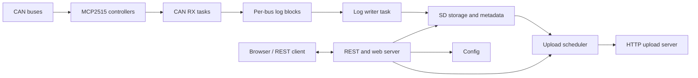

# CAN-Grabber

CAN-Grabber is an ESP32-S3 based multi-bus CAN logger. The firmware captures
CAN traffic, writes timestamped SavvyCAN-compatible log files to SD storage,
serves a local web and REST control plane, and can upload completed log files to
an HTTP endpoint.

Development experiments are kept outside the production source tree with their
code, tools, documentation, and historical evidence.

## Repository Map

| Path | Purpose |
| --- | --- |
| `src/` | Production firmware modules |
| `include/` | Public module headers |
| `data/` | Embedded web UI assets for PlatformIO filesystem upload |
| `docs/` | Architecture, component, testing, and history documentation |
| `tools/` | Production-support scripts and CAN tooling |
| `experiments/` | Hardware experiments, test tools, configuration examples, and results |
| `can_grabber_server/` | Local CAN Grabber Server for DBC editing, InfluxDB startup, and ESP32 uploads |
| `Reference/` | Reference implementations and third-party comparison material |

## Start Here

- [Documentation Index](docs/README.md)
- [Software Architecture](docs/software-architecture.md)
- [Component Documentation](docs/components/)
- [Experiment Catalog](experiments/README.md)
- [Hardware Experiment Guide](docs/testing/hardware-test-stubs.md)
- [Implementation History](docs/history/implementation-log.md)

## Main Build Commands

```powershell
platformio run -e esp32s3
platformio run -e esp32s3_release
platformio run -d experiments -e rx_load_test
platformio run -d experiments -e sd_sdio_speed_test
platformio run -d experiments -e sd_http_upload_ui_test_v5
```

Some build commands may require the local PlatformIO package cache or hardware
access. Keep generated build output under `.pio/` out of version control.

The root `platformio.ini` intentionally exposes production environments only.
See the [experiment catalog](experiments/README.md) for experiment-specific
commands, setup, and evidence.

## Runtime Overview



## Documentation Policy

The current documentation language is English. Historical German requirements
remain unchanged. Raw test evidence and legacy stage snapshots are organized
under the owning experiment and must not be removed without first preserving a
summary and the relevant Git history.
