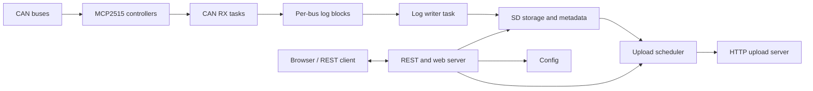

# CAN-Grabber

CAN-Grabber is an ESP32-S3 based multi-bus CAN logger. The firmware captures
CAN traffic, writes timestamped SavvyCAN-compatible log files to SD storage,
serves a local web and REST control plane, and can upload completed log files to
an HTTP endpoint.

This branch contains a clean English documentation structure. It does not move
the firmware source tree or delete historical test results.

## Repository Map

| Path | Purpose |
| --- | --- |
| `src/` | Production firmware modules and development test sketches |
| `include/` | Public module headers |
| `data/` | Embedded web UI assets for PlatformIO filesystem upload |
| `docs/` | Architecture, component, testing, and history documentation |
| `tools/` | Desktop scripts, test tools, upload mock server, and CAN tooling |
| `can_grabber_server/` | Local CAN Grabber Server for DBC editing, InfluxDB startup, and ESP32 uploads |
| `logs/` | Preserved hardware test logs and summaries |
| `archives/` | Stage snapshots from previous implementation work |
| `Reference/` | Reference implementations and third-party comparison material |

## Start Here

- [Documentation Index](docs/README.md)
- [Software Architecture](docs/software-architecture.md)
- [Component Documentation](docs/components/)
- [Hardware Test Stubs](docs/testing/hardware-test-stubs.md)
- [Upload UI v5 Test Architecture](docs/testing/upload-ui-v5.md)
- [Implementation History](docs/history/implementation-log.md)

## Main Build Commands

```powershell
platformio run -e esp32s3
platformio run -e esp32s3_release
platformio run -e rx_load_test
platformio run -e sd_sdio_speed_test
platformio run -e sd_http_upload_ui_test_v5
```

Some build commands may require the local PlatformIO package cache or hardware
access. Keep generated build output under `.pio/` out of version control.

## Runtime Overview



## Documentation Policy

The current documentation language is English. Historical German requirements
and raw test evidence are preserved in the repository history and existing log
artifacts until a separate cleanup pass decides where to archive them.

Do not delete test logs or stage snapshots during documentation work. They are
valuable evidence for upload, SD, boot, and runtime stability decisions.
