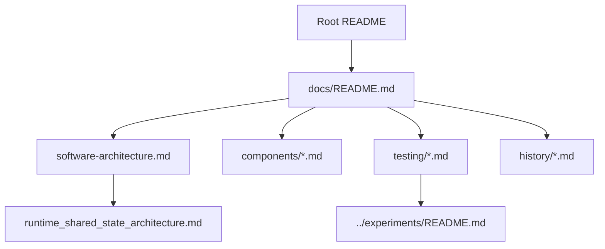

# CAN-Grabber Documentation

This directory contains the current English documentation structure for the
CAN-Grabber firmware and related tools.

## Architecture

- [Software Architecture](software-architecture.md)
- [Runtime Shared-State Architecture](runtime_shared_state_architecture.md)

## Runtime Components

- [Configuration](components/config.md)
- [Storage](components/storage.md)
- [CAN Manager](components/can.md)
- [Log Writer](components/logging.md)
- [Upload Manager](components/upload.md)
- [Network Manager](components/network.md)
- [REST API](components/rest-api.md)
- [Web Server](components/web-server.md)
- [RTC Clock](components/rtc-clock.md)
- [System Stats](components/system-stats.md)
- [Compressor](components/compressor.md)

## Testing

- [Hardware Experiment Guide](testing/hardware-test-stubs.md)
- [Experiment Catalog](../experiments/README.md)
- [Upload UI Experiment](../experiments/upload-ui/README.md)

## History

- [Implementation Log](history/implementation-log.md)

## Documentation Map

