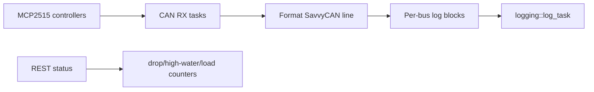

# CAN Manager Component

## Purpose

The `can` component owns CAN controller initialization, receive tasks, per-bus
block buffers, and CAN-related runtime counters.

## Public API

- Header: `include/can/can_manager.h`
- Implementation: `src/can/can_manager.cpp`
- Main types: `can::Frame`, `can::LogBlock`, `can::BusConfig`

## Owned State

- Per-bus task handles
- Per-bus `BusState`
- Per-bus `LogBlockState` rings
- Drop, high-water, load, and simulated-load counters

## Data Flow

## Runtime Behavior

- `can::init()` configures enabled buses and starts receive tasks.
- RX tasks append formatted lines into the active block.
- A ready block is acquired by the log writer and released after flush.
- `CAN_SIMULATED_LOAD` and `RX_LOAD_TEST` paths support load testing.

## Failure Modes

- Controller init failure prevents a bus RX task from running.
- Full block rings cause drops.
- `can::pop_rx_frame()` is a stub for the current mainline path; the block
  handoff is the real logging interface.

## Test Strategy

- Hardware CAN receive test with known traffic.
- `rx_load_test` for synthetic block production and log-writer pressure.
- REST status checks for drops, high-water, and queue depth.
