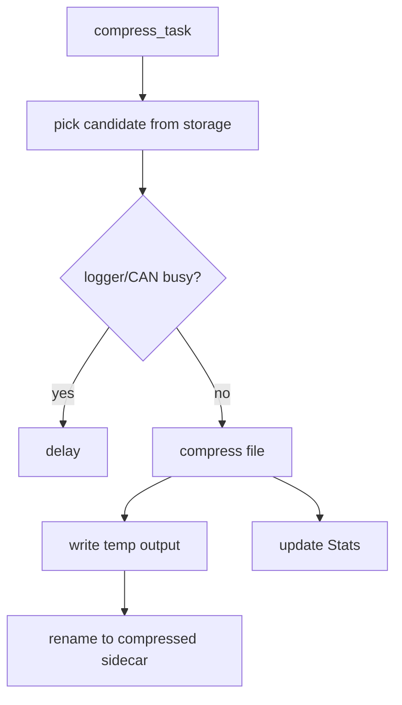

# Compressor Component

## Purpose

The `compressor` component optionally compresses closed log files in the
background when the system is not under storage or logging pressure.

## Public API

- Header: `include/compress/compressor.h`
- Implementation: `src/compress/compressor.cpp`
- Main type: `compressor::Stats`

## Owned State

- Compressor task handle
- Active/progress counters
- Total compressed files counter
- Stats mux

## Runtime Behavior

- Enabled only when `ENABLE_COMPRESSOR` is set.
- Scans storage metadata for compression candidates.
- Defers when storage is low or logging/CAN activity is busy.
- Writes compressed sidecar files and removes temporary files on success/failure.

## Flow

## Failure Modes

- Low free space.
- Candidate file missing.
- Compression allocation failure.
- Output write failure.

## Test Strategy

- Build with `ENABLE_COMPRESSOR=1`.
- Seed closed log files and verify sidecar generation.
- Verify deferral during active logging.
