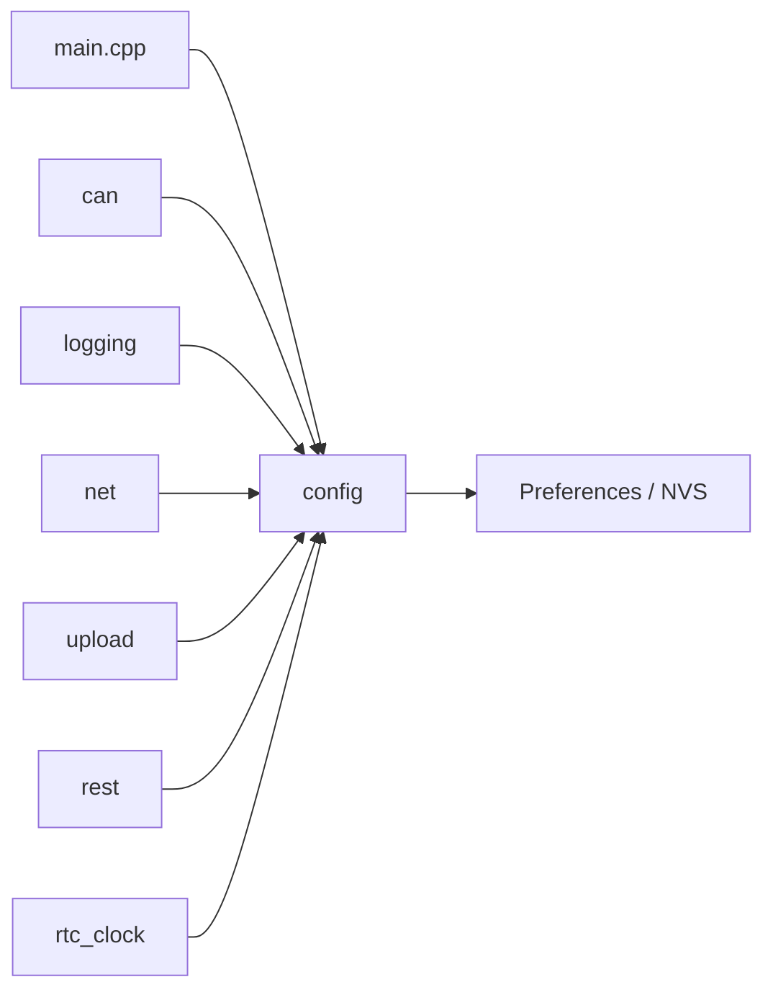

# Configuration Component

## Purpose

The `config` component owns persistent runtime configuration for CAN buses,
WiFi, logging, upload, REST authentication, and related global settings.

## Public API

- Header: `include/config/app_config.h`
- Implementation: `src/config/app_config.cpp`
- Main types: `config::Config`, `config::GlobalConfig`, `config::BusConfig`,
  `config::WifiConfig`

## Owned State

- Module-private `config::s_config`
- NVS persistence through Arduino `Preferences`
- Migration loaders for older config schema versions

## Collaborators

## Runtime Behavior

- `config::init()` loads configuration from NVS or applies defaults.
- REST handlers mutate `config::get_mutable()` and call `config::save()`.
- Serial debug commands can update WiFi settings.
- Runtime modules read configuration directly when they need it.

## Failure Modes

- Missing or corrupt NVS data falls back to defaults.
- Invalid bus names are sanitized.
- Current design has no synchronization around `s_config`; runtime writers
  should remain rare until the config model is normalized.

## Test Strategy

- Unit-style host tests can validate migration and sanitization if config logic
  is separated from Arduino `Preferences`.
- Hardware/firmware tests should verify boot default load, REST updates, NVS
  persistence across restart, and WiFi slot changes.
