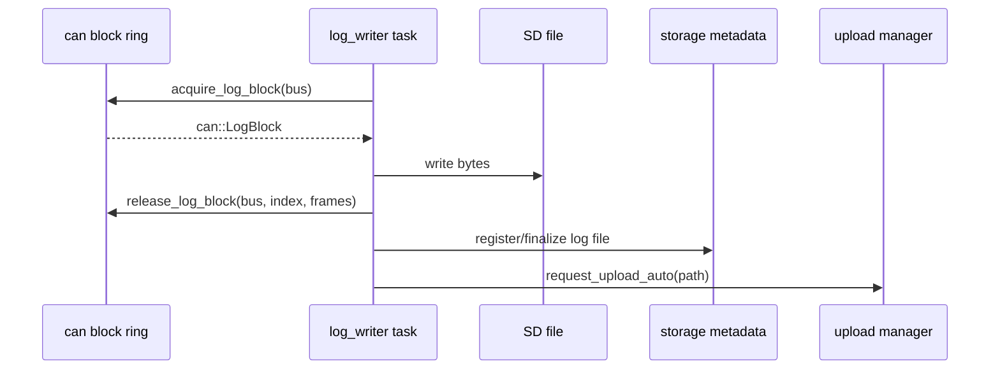

# Log Writer Component

## Purpose

The `logging` component drains ready CAN log blocks and writes SavvyCAN ASCII log
files to SD storage.

## Public API

- Header: `include/logging/log_writer.h`
- Implementation: `src/logging/log_writer.cpp`
- Main type: `logging::Stats`

## Owned State

- Per-bus `BusLogState`
- `log_writer` task handle
- Module-private counters guarded by `s_stats_mux`

## Runtime Flow

## Runtime Behavior

- `logging::start()` opens log files for enabled/logging buses whose RX tasks
  are running.
- `log_task()` drains ready blocks and writes bytes to SD.
- Files rotate when configured max size would be exceeded.
- Closing a file finalizes metadata and auto-enqueues upload.

## Failure Modes

- SD not ready prevents logging start.
- File open/write failures are counted in `logging::Stats`.
- Reopen attempts recover from some write failures.
- `logging::enqueue()` is a placeholder and must not be used as the primary
  test path for log-writer throughput.

## Test Strategy

- `rx_load_test` exercises block production, log writer, SD writes, and counters.
- Hardware CAN traffic tests verify real receive-to-file behavior.
- Verify `write_failures`, `open_failures`, `reopen_failures`, drops, and final
  file metadata.
