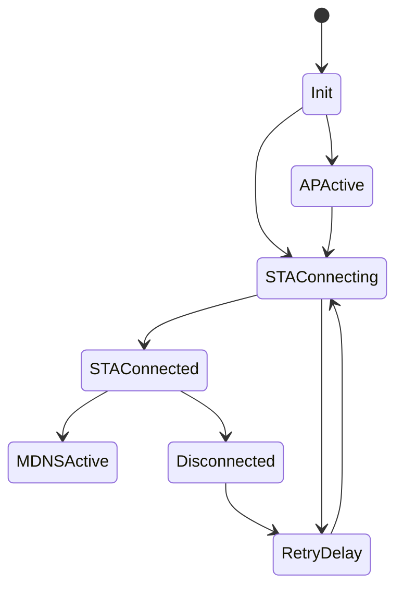

# Network Manager Component

## Purpose

The `net` component owns WiFi station/AP behavior, reconnect logic, mDNS state,
and WiFi scan cache.

## Public API

- Header: `include/net/net_manager.h`
- Implementation: `src/net/net_manager.cpp`
- Main type: `net::WifiScanEntry`

## Owned State

- STA/AP connection state
- WiFi event registration state
- Scan result cache
- mDNS retry state
- AP client activity tracking

## Runtime View

## Runtime Behavior

- `net::init()` configures WiFi event handling.
- `net::connect()` starts station/AP behavior based on config.
- `net::loop()` handles retries, scans, AP lifecycle, and mDNS recovery.
- REST reads connection and scan status.

## Failure Modes

- No configured SSID.
- STA connection timeout.
- mDNS start failure.
- Scan cache staleness.
- Meaningful shared state is not yet normalized into a single public stats
  snapshot.

## Test Strategy

- STA/AP transition tests.
- REST WiFi scan/status checks.
- Upload reachability tests under connect/disconnect conditions.
