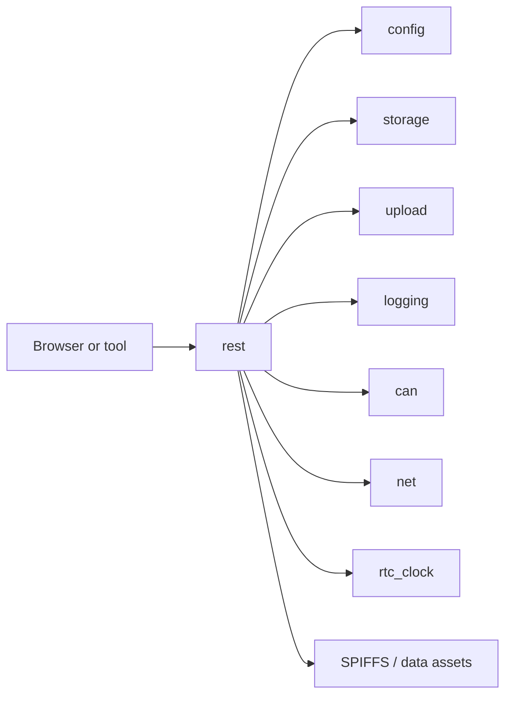

# REST API Component

## Purpose

The `rest` component exposes the HTTP control plane for status, configuration,
file operations, time setting, upload control, and static asset serving.

## Public API

- Header: `include/rest/rest_api.h`
- Implementation: `src/rest/rest_api.cpp`

## Collaborators

## Runtime Behavior

- `rest::init()` configures routes and static asset handling.
- `rest::start()` starts serving.
- `rest::loop()` processes client requests.
- Status payloads aggregate best-effort snapshots from multiple modules.

## Failure Modes

- Missing SPIFFS assets.
- Authentication token mismatch when token is configured.
- Long file responses can affect responsiveness.
- Status snapshots are not system-wide transactions; each module is read
  independently.

## Test Strategy

- Route-level HTTP tests for status, config, files, upload, and time.
- Auth-required and no-auth cases.
- UI polling latency during active upload.
