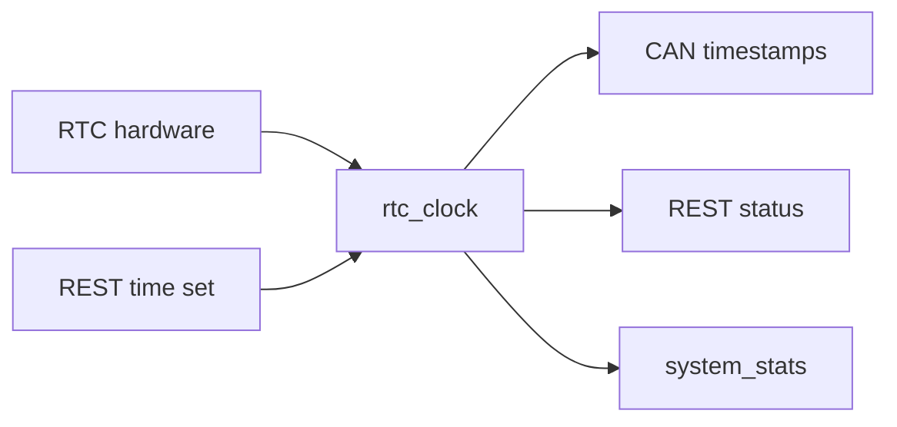

# RTC Clock Component

## Purpose

The `rtc_clock` component provides runtime timekeeping and optional RTC-backed
Unix timestamp support.

## Public API

- Header: `include/rtc/rtc_clock.h`
- Implementation: `src/rtc/rtc_clock.cpp`
- Main type: `rtc_clock::Source`

## Owned State

- Base Unix epoch
- Base `millis()` timestamp
- Availability, running, valid, and source flags

## Runtime Behavior

- `rtc_clock::init()` probes RTC availability and establishes time state.
- `now_unix_sec()` and `now_unix_ms()` derive current time from base epoch and
  uptime.
- REST can set time through `set_unix_epoch()`.

## Data Flow

## Failure Modes

- RTC not present.
- RTC present but invalid or stopped.
- Lock-free shared state relies on rare writes.

## Test Strategy

- `rtc_module_test` for hardware checks.
- REST time-set persistence and status validation.
- Timestamp sanity in generated CAN log files.
