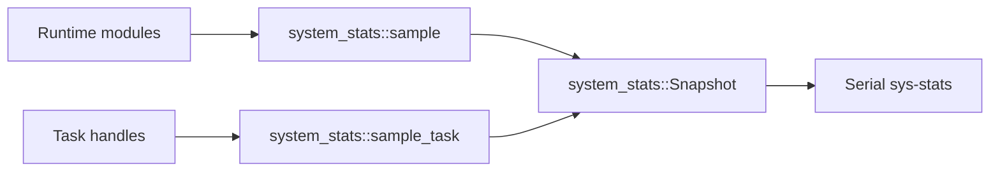

# System Stats Component

## Purpose

The `system_stats` component owns diagnostic snapshots for heap, stack, uptime,
RTC status, and component-level health sampling.

## Public API

- Header: `include/system/system_stats.h`
- Implementation: `src/system/system_stats.cpp`
- Main types: `system_stats::Snapshot`, `ComponentStat`, `TaskStat`

## Owned State

- Component stats array
- Task stats array
- Snapshot copy-out boundary
- Stats mux protecting internal arrays

## Runtime Behavior

- `system_stats::init()` initializes diagnostic state.
- Modules call `sample()` to update component health.
- `sample_task()` records stack watermark data.
- `snapshot()` returns a coherent copy of diagnostic arrays.

## Diagnostic Flow

## Failure Modes

- Missing sampling calls lead to stale diagnostics.
- Fixed task slot count can drop visibility for additional tasks.

## Test Strategy

- Serial `sys-stats` command.
- Boot sampling checks after each major init step.
- Future REST exposure of `Snapshot`.
