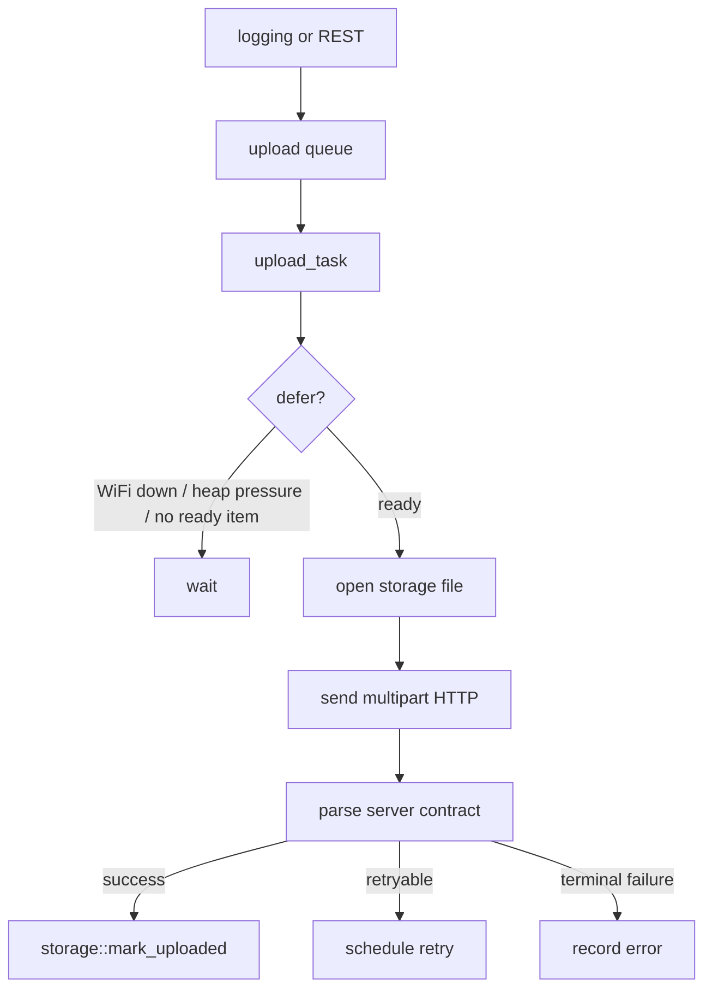

# Upload Manager Component

## Purpose

The `upload` component owns upload scheduling, retry state, server reachability,
multipart HTTP transfer, and upload status reporting.

## Public API

- Header: `include/upload/upload_manager.h`
- Implementation: `src/upload/upload_manager.cpp`
- Main type: `upload::Stats`

## Owned State

- Fixed upload queue `s_queue[]`
- Upload task handle
- Upload progress counters guarded by `s_stats_mux`
- Queue state guarded by `s_queue_mux`
- DNS/probe cache and reachability status

## Upload Flow

## Runtime Behavior

- `request_upload()` and `request_upload_auto()` add or bump queue entries.
- `queue_pending()` scans storage metadata for pending files.
- `upload_task` uploads ready files, parses HTTP/JSON response, and applies
  retry policy.
- Status snapshots expose current file, sent bytes, speed, errors, and server
  reachability.

## Failure Modes

- WiFi disconnected, DNS failure, connect failure, timeout, missing file, HTTP
  failure, invalid server contract, and heap pressure.
- Retryable failures remain queued with `next_attempt_ms`.
- Successful upload depends on both HTTP status and the expected JSON contract.

## Test Strategy

- `sd_http_post_speed_test` for transport profile and throughput tuning.
- `sd_http_upload_ui_test_v5` for queue, retry, reset, bookkeeping, probe, and
  UI responsiveness behavior.
- Mock server tests with `tools/can-upload-mock`.
