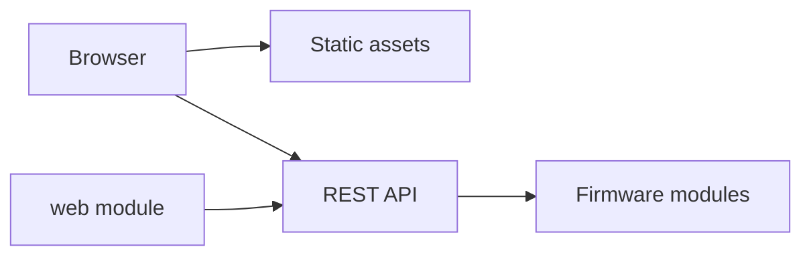

# Web Server Component

## Purpose

The `web` component is the lightweight wrapper around web UI lifecycle hooks.
Most HTTP behavior currently lives in the REST component.

## Public API

- Header: `include/web/web_server.h`
- Implementation: `src/web/web_server.cpp`

## Runtime Behavior

- `web::init()` initializes web UI state.
- `web::start()` starts serving UI behavior where applicable.
- `web::loop()` is called from the Arduino main loop.

## Relationship To REST

## Failure Modes

- Current implementation is intentionally thin.
- Any richer web behavior must avoid duplicating REST ownership.

## Test Strategy

- Verify the root UI loads.
- Verify REST endpoints used by the UI return expected JSON.
- Verify UI polling remains responsive during logging/upload.
