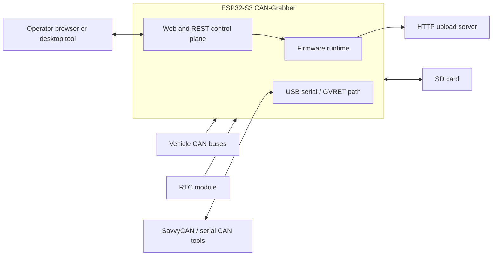
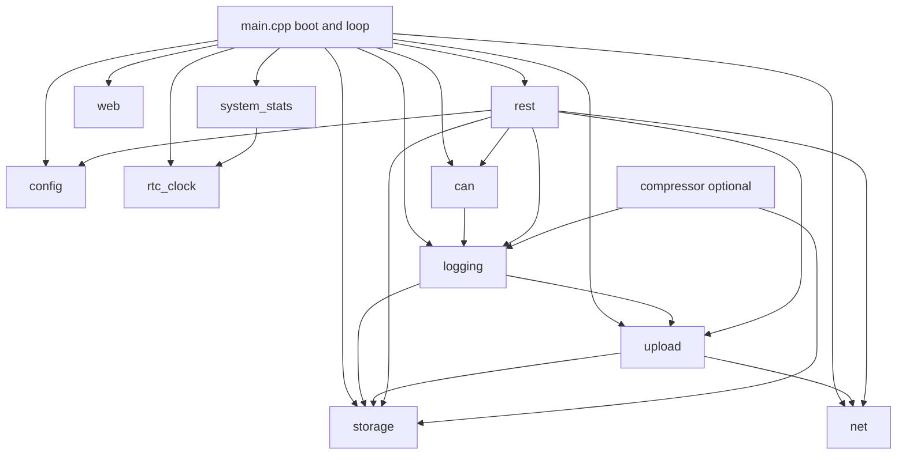
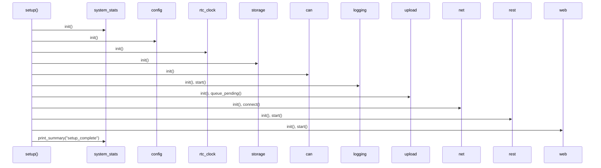
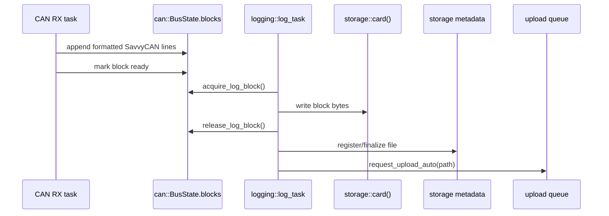
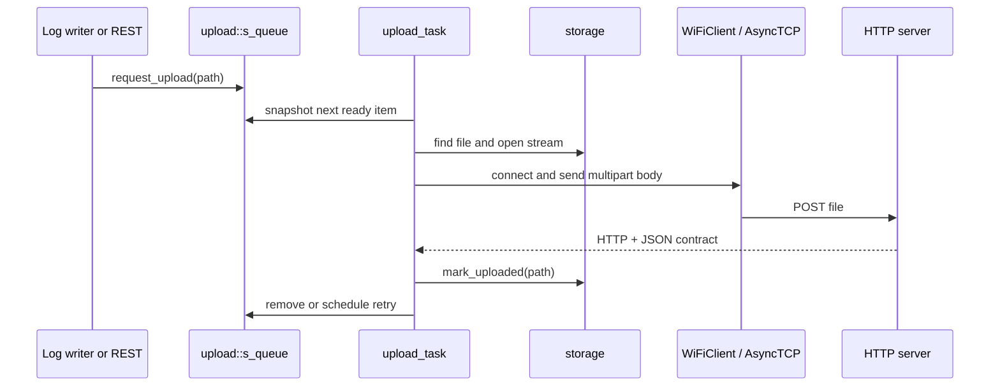
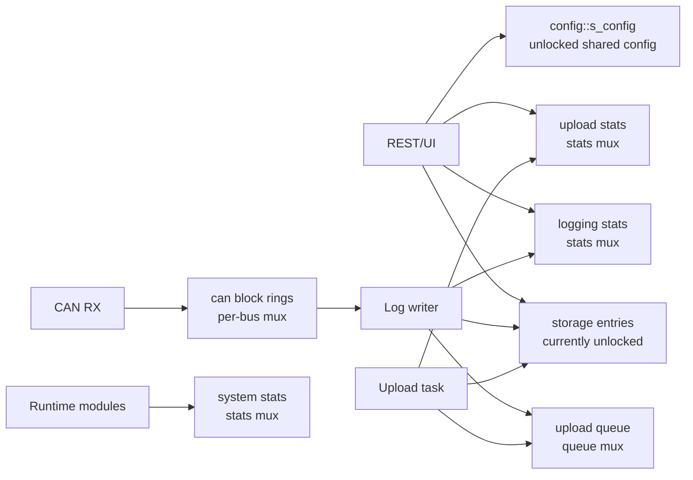

# Software Architecture

## Purpose

CAN-Grabber is a task-based embedded firmware for an ESP32-S3 CAN logger. It is
designed to keep time-critical CAN receive work separate from SD storage,
network, REST, web UI, and upload work.

## System Context

## Firmware Component View

## Boot Sequence

## CAN Logging Data Flow

## Upload Data Flow

## Runtime Task Model

| Task / Context | Owner | Responsibility |
| --- | --- | --- |
| Arduino `setup()` / `loop()` | `main.cpp` | Boot ordering, serial console, module polling |
| CAN RX tasks | `can` | Receive CAN frames and fill per-bus log blocks |
| `log_writer` | `logging` | Drain ready CAN blocks and write SD log files |
| `upload_task` | `upload` | Upload closed files and retry failures |
| `compress_task` | `compressor` | Optional background compression |
| WiFi event task | Arduino WiFi + `net` | Connection events, AP/STA state, mDNS |
| REST/Web loop | `rest`, `web` | Control plane and static UI serving |

## Shared-State Ownership

## Current Risks And Target Direction

Strong current patterns:

- CAN-to-log-writer payload transfer has a clear block handoff contract.
- `logging::Stats`, `upload::Stats`, and `system_stats::Snapshot` use explicit
  copy-out snapshot boundaries.
- Upload retry state is owned by the upload module.

Known weak points:

- `config::s_config` is globally mutable without a lock.
- `storage::s_entries[]` is shared by logging, upload, compressor, and REST
  without a lock.
- `logging::enqueue()` is a legacy placeholder and does not feed the current
  block-based log writer.
- `can::pop_rx_frame()` is not the mainline data path.

Target cleanup direction:

- One owner per mutable runtime table.
- One explicit handoff object per task boundary.
- One public `Stats` or `Snapshot` type per UI-facing module.
- One synchronization strategy per module.

## Component Documentation

See [components/](components/) for focused module documentation.
