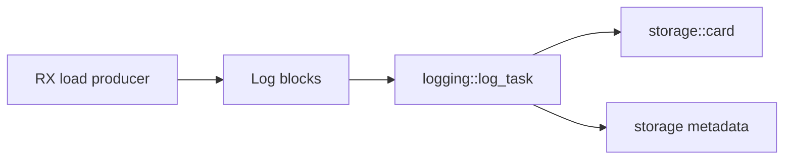

# Hardware Test Stubs

## Purpose

Hardware test stubs verify real ESP32-S3, SD, CAN, WiFi, and upload behavior.
They should be separate PlatformIO environments when they stress hardware or
change runtime scheduling assumptions.

## Existing Test Environments

| Env | Source | Purpose |
| --- | --- | --- |
| `sd_speed_test` | `src/dev/sd_speed_test.cpp` | Raw SPI SD write sweep |
| `sd_sdio_speed_test` | `src/dev/sd_sdio_speed_test.cpp` | Raw SD_MMC/SDIO write sweep |
| `rx_load_test` | `src/dev/rx_load_test.cpp` | Synthetic CAN/log-writer/storage pressure |
| `sd_http_post_speed_test` | `src/dev/sd_http_post_speed_test.cpp` | SD-to-HTTP upload transport benchmarking |
| `sd_http_upload_ui_test_v5` | `src/dev/sd_http_upload_ui_test_v5.cpp` | Upload UI, queue, retry, and responsiveness tests |

## Planned Storage Write Performance Stub

Name:

- Env: `sd_storage_write_perf_test`
- Source: `src/dev/sd_storage_write_perf_test.cpp`

Intent:

- Exercise the production storage layer, not a separate test-only SD object.
- Use `storage::init()` and `storage::card()`.
- Write deterministic pseudo-random data blocks.
- Measure write throughput, flush time, file size, and checksum/readback.
- Print machine-readable serial output.

Expected serial result format:

```text
RESULT test=sd_storage_write_perf mounted=1 bytes=16777216 block=4096 write_ms=1234 flush_ms=12 mb_s=12.97 checksum=0x12345678 verify=1
```

Recommended checks:

- SD mounted successfully.
- Written byte count equals requested byte count.
- File size matches written bytes.
- Readback checksum matches write checksum.
- No write or flush failures.

## Log Writer Integration Testing

Do not test log-writer throughput through `logging::enqueue()`. That API is a
legacy placeholder in the current block-based design.

Use `rx_load_test` for the production-like path:



Important metrics:

- Target FPS per bus
- Produced and consumed frame counts
- Queue depth
- Dropped frames
- `logging::Stats.bytes_per_sec`
- Write failures
- Open/reopen failures

## Evidence Handling

Preserve serial logs, JSONL files, and summary files under `logs/` until the
repository cleanup pass moves them into a structured artifact area.
