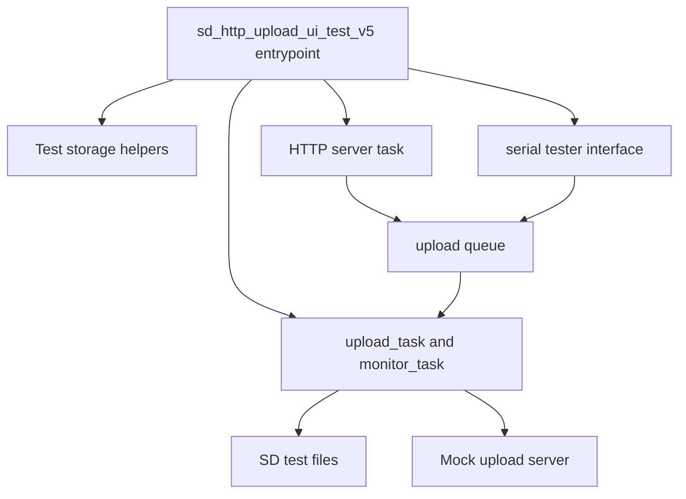

# Upload UI v5 Test Architecture

This page is the documentation entrypoint for the `sd_http_upload_ui_test_v5`
development harness.

The detailed source architecture currently lives in:

- [Upload UI Test v5 Architecture](../upload_ui_test_v5_architecture.md)

## Scope

The v5 harness validates:

- SD test file creation
- Upload queue seeding
- HTTP `/status`, `/start`, `/abort`, `/reset_upload_state`, and bookkeeping
- Retry/backoff behavior
- Server contract validation
- Uploaded-state persistence
- Reachability probe and cache behavior
- UI responsiveness while upload is active

## Runtime View

## Related Tools

- `tools/upload_ui_tester_v5.py`
- `tools/upload_ui_test_runbook.md`
- `tools/can-upload-mock/server.py`

## Evidence

Historical results are preserved under `logs/` and summarized in
`IMPLEMENTATION_LOG.md`.
