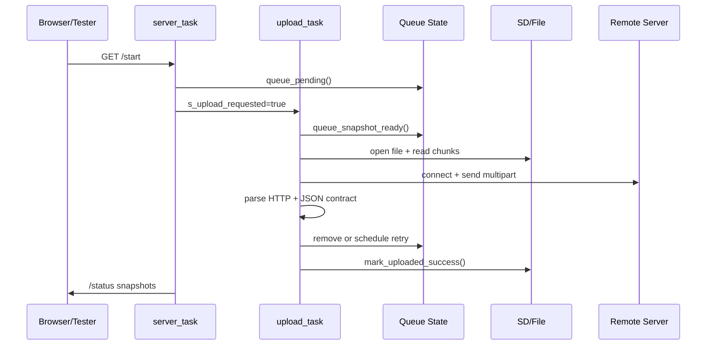
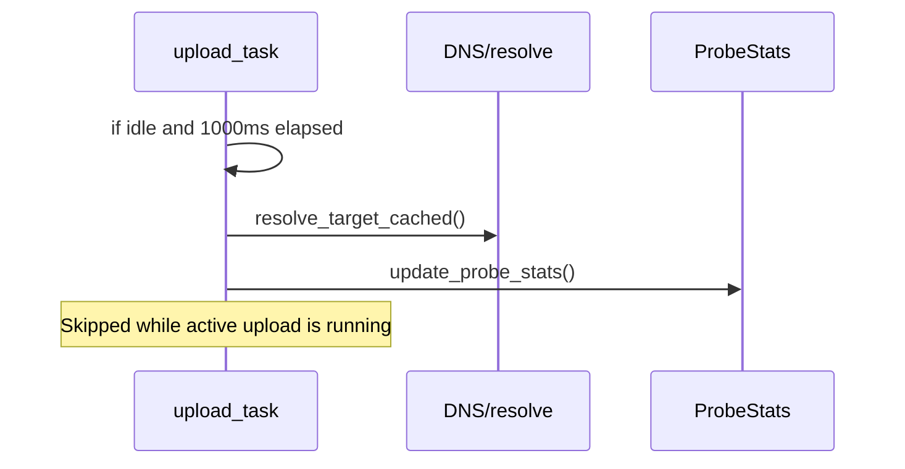

# Upload UI Test v5 Architecture

## 1) Scope
This document describes the runtime architecture of `sd_http_upload_ui_test_v5`, focusing on:
- RTOS tasks and responsibilities
- Shared data and synchronization
- Task-to-task data exchange paths
- External interfaces (`/status`, `/start`, serial commands)

Source files:
- `experiments/upload-ui/code/v5/modules/main.cpp`
- `experiments/upload-ui/code/v5/modules/storage.cpp`
- `experiments/upload-ui/code/v5/modules/uploader.cpp`
- `experiments/upload-ui/code/v5/modules/webserver.cpp`
- `experiments/upload-ui/code/v5/modules/serial_tester_interface.cpp`

## 2) Runtime Components
| Component | File | Trigger/Loop | Responsibility |
|---|---|---|---|
| Boot + task wiring (`setup`) | `experiments/upload-ui/code/v5/modules/main.cpp` | One-shot at boot | Parse target URL, connect Wi-Fi, init SD, seed queue, create tasks |
| Serial polling (`loop`) | `experiments/upload-ui/code/v5/modules/main.cpp` | Arduino main loop | Dispatch non-blocking serial commands |
| Upload Manager Task (`upload_task`) | `experiments/upload-ui/code/v5/modules/uploader.cpp` | FreeRTOS loop | Pop queued file, upload multipart HTTP, apply retry policy, update stats, mark uploaded-state |
| HTTP Server Task (`server_task`) | `experiments/upload-ui/code/v5/modules/webserver.cpp` | FreeRTOS loop | Run `WebServer::handleClient()`, serve UI/API endpoints |
| Monitor Task (`monitor_task`) | `experiments/upload-ui/code/v5/modules/uploader.cpp` | FreeRTOS loop (1 s) | Wi-Fi reconnect check, periodic pending-file scan, periodic progress logs |
| Prefetch Task (`prefetch_task`) | `experiments/upload-ui/code/v5/modules/uploader.cpp` | FreeRTOS task | Currently disabled (immediate self-delete) |
| Shared state/storage helpers | `experiments/upload-ui/code/v5/modules/storage.cpp` | Called by tasks/endpoints | Queue ops, stats snapshots, probe cache/stats, SD and uploaded-state helpers |

## 3) Shared Data Contracts
| Data | Defined in | Written by | Read by | Sync model | Meaning |
|---|---|---|---|---|---|
| `s_stats` (`UploadStats`) | `storage.cpp` | `upload_task` via `update_stats()` | `/status`, serial `status`, monitor logs | `s_stats_mux` critical section | Upload state machine and throughput counters |
| `s_probe_stats` (`ProbeStats`) | `storage.cpp` | Reachability probe path | `/status` | `s_probe_mux` critical section | Probe health, latency, last IP/error, cache hit/miss counters |
| `s_queue[kQueueLen]` | `storage.cpp` | queue helpers (`queue_pending`, retry scheduling, remove) | `upload_task`, `/status` summaries, serial bookkeeping | `s_queue_mux` critical section | Pending file queue with retry metadata |
| `s_upload_requested` | `storage.cpp` | `/start`, serial `start` | `upload_task` | atomic | Latch to request upload processing |
| `s_abort_requested` | `storage.cpp` | `/abort`, serial `abort`, reset flows | upload write loop / finalize path | atomic | Cooperative abort flag |
| `s_sd_available` | `storage.cpp` | SD init/recovery flows | `/status`, `/start`, serial start guard, uploader idle gate | atomic | Storage availability gate |
| `s_active_run_id` / `s_run_counter` | `storage.cpp` | `upload_task` | monitor progress log | atomic | Correlates serial progress/end log lines |
| `s_terminal_state_until_ms` | `storage.cpp` | `upload_task` | `upload_task` idle display hold | atomic | Holds DONE/ERROR state briefly for UI pollers |
| DNS cache (`s_probe_cached_ip*`) | `storage.cpp` | resolve/probe helpers | uploader connect/probe paths | plain vars in helper path | Cached target IP with TTL |
| Uploaded-state files (`kUploadedStatePath`, `kUploadedMetaPath`) | `storage.cpp` | successful upload path + reset path | queue seeding/bookkeeping endpoint/self-tests | filesystem | Persistence of done files + metadata |

## 4) Data Exchange by Interface
## 4.1 HTTP API
| Endpoint | Producer path | Consumer | Core data exchanged |
|---|---|---|---|
| `GET /status` | `webserver.cpp` snapshot builders | Web UI poller / test automation | Upload stats, SD availability, probe stats, queue counters, done/left bytes, ETA |
| `GET /start` | `webserver.cpp` | User/tester | Sets `s_upload_requested`, seeds queue |
| `GET /abort` | `webserver.cpp` | User/tester | Sets abort flag |
| `GET /reset_upload_state` | `webserver.cpp` + storage reset helper | User/tester | Clears uploaded-state persistence and requeues files |
| `GET /bookkeeping` | `webserver.cpp` + storage summaries | User/tester | uploaded/outstanding/queue counts |
| `GET /test/*` | `webserver.cpp` self-test handlers | User/tester | deterministic PASS/FAIL checks for features |

## 4.2 Serial Interface
| Command | Handler file | Core data exchanged |
|---|---|---|
| `start`, `abort` | `serial_tester_interface.cpp` | Same control flags as HTTP |
| `status` | `serial_tester_interface.cpp` | `UploadStats` snapshot |
| `bookkeeping` | `serial_tester_interface.cpp` | uploaded/outstanding/queue summary |
| `test_*` | `serial_tester_interface.cpp` | Feature self-test pass/fail |

## 5) Main Execution Flows
## 5.1 Start-to-upload flow

## 5.2 Idle reachability flow

## 6) Concurrency and Safety Notes
- Queue and stats are protected by dedicated `portMUX_TYPE` locks for short critical sections.
- Control flags are atomics for low-overhead cross-task signaling.
- `upload_task` is the single writer for most upload lifecycle transitions.
- `server_task` and serial handlers are control-plane interfaces; they should avoid long blocking operations.
- SD runtime recovery is startup-gated in current design (`recover_sd` endpoints/serial return startup-only).

## 7) Professional Documentation Pattern (Recommended)
For ongoing maintenance, use this structure:
1. C4-style views:
   - Level 2 (Container): firmware + external server + operator tools
   - Level 3 (Component): task-level responsibilities (this document)
2. Data contract tables:
   - Shared in-memory contracts (ownership, writer/reader, sync primitive)
   - API contracts (`/status` fields, serial command semantics)
3. Behavioral diagrams:
   - Sequence diagrams for critical flows (`/start`, retry, reset, abort)
   - State machine for `UploadState` and retry transitions
4. ADRs (Architecture Decision Records):
   - Keep short ADR files for decisions like retry policy, probe cadence, startup-only SD recovery
5. Operational addendum:
   - Mapping from metrics/log fields to troubleshooting steps

This combination is typically what teams expect in professional embedded/networked systems documentation.
